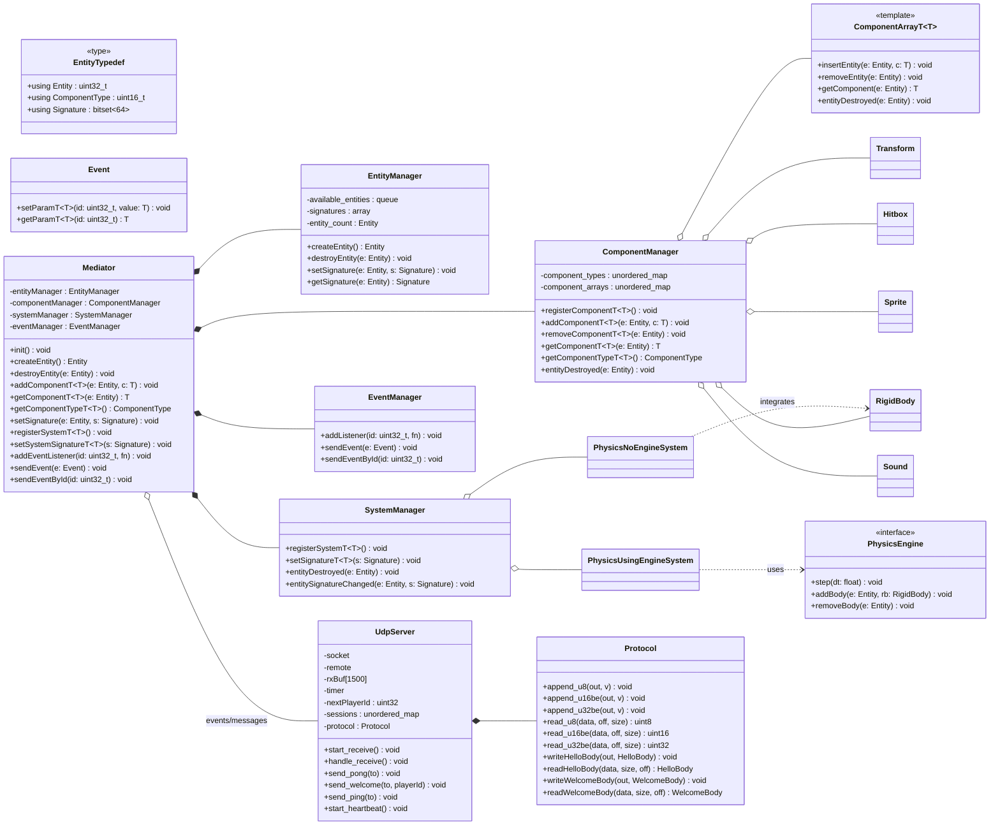

# R‑TYPE — Online Shoot’em Up + Game Engine (C++17)

_Multiplayer R‑Type‑like with an in‑house engine (ECS), an authoritative UDP server, and a graphical SFML client._

> **Binaries:** `r-type_server` & `r-type_client` • **Build:** CMake (+ Ninja) • **Client:** SFML 2.6.x • **Server:** Boost.Asio (via CPM.cmake)

---

## ✨ Overview

- **Client:** SFML rendering, screens **Launch → Menu → Lobby → Settings**, particles/starfield, control remapping, embedded sounds & fonts.
- **Server:** **UDP** networking I/O with **Boost.Asio**, client sessions, **binary handshake** (Hello/Welcome), **heartbeat/ping**.
- **Engine (libengine):** **ECS** core (Entity/Component/System + Mediator, Event bus), components `Transform`, `Sprite`, `RigidBody`, `Gravity`, systems `PlayerControl`, `Physics`, `Render`.
- **Build:** `./ci/build.sh` (CMake + Ninja). Binaries are generated **at the project root**.

Project layout (excerpt):
```
.
├─ CMakeLists.txt                 # Places binaries at the repo root
├─ ci/                            # Local CI scripts
│  ├─ build.sh                    # CMake + Ninja (Release)
│  ├─ test.sh                     # ctest (if present)
│  └─ check_clang_format.sh
├─ cmake/CPM.cmake                # Dependencies via CPM
├─ libengine/                     # Engine library (ECS)
├─ include_common/                # Shared ECS headers
├─ Server/                        # UDP server code (Boost.Asio)
├─ Client/                        # SFML client (UI + game)
├─ assets/                        # R-Type fonts & spritesheets
├─ sound/                         # Music & SFX
└─ sprite/                        # PNGs for menu/logo/error
```

---

## 🚀 Quick Start

### Prerequisites (Linux — e.g., Fedora 41)
```bash
sudo dnf install cmake ninja-build gcc-c++ SFML-devel
# Boost is fetched automatically for the server via CPM.cmake
```

_Ubuntu/Debian:_
```bash
sudo apt-get install cmake ninja-build g++ libsfml-dev
```


### Prerequisites & Build (Windows — Chocolatey)
```powershell 
choco install cmake python ninja mingw
git clone https://github.com/Jeami-s-Orga-Tek/R-TYPE.git
cd R-TYPE
cmake -S . -B build -G "Ninja" -DCMAKE_BUILD_TYPE=Release
cmake --build build --config Release --parallel
cp build\_deps\sfml-src\extlibs\bin\x64\openal32.dll .
```


### Build
From the **repository root**:
```bash
./ci/build.sh
# ➜ produces ./r-type_server and ./r-type_client at the repo root
```

### Run the server
```bash
./r-type_server [--ip <bind_ip>] [--port <port>] [--max-players <n>]
```
- `--ip <bind_ip>`: IP address to bind the server (default: 127.0.0.1)
- `--port <port>`: UDP port to listen on (default: 8080)
- `--max-players <n>`: Maximum number of players (default: 1)
- **Authoritative** server (game logic runs server-side).
- Async I/O loop, session handling, ping/heartbeat.
- Files: `Server/src/main.cpp`, `Server/src/net/UdpServer.*`, `Server/src/util/Log.hpp`.

### Run the client
```bash
./r-type_client [--ip <server_ip>] [--port <port>]
```
- `--ip <server_ip>`: IP address of the server to connect to (default: 127.0.0.1)
- `--port <port>`: UDP port of the server (default: 8080)
- The client connects when clicking **Play** (see `Client/src/GameTypes.cpp`).
- **Important:** run **from the project root** so it can access `assets/`, `sound/`, `sprite/`.

---

## 🎮 Controls & Audio

- **Movement:** **← → ↑ ↓ (configurable in Settings)**
- **Shoot:** **Space**
- **Remap:** **Settings → Controls** menu (class `ControlsConfig`).
- **Audio:** music & SFX in `sound/` (e.g., `Menu_sound.mp3`, `Start_sound.mp3`).
- **Fonts:** `assets/r-type.otf`, `assets/retro.ttf`.

---

## 🧱 Architecture

### ECS (Entity‑Component‑System)
- **Entities:** numeric identifiers.
- **Components:** pure data (e.g., `Transform`, `Sprite`, `RigidBody`, `Gravity`).
- **Systems:** independent logic (e.g., `PlayerControl`, `Physics`, `Render`).
- **Mediator/Event bus:** decoupled communication between systems.

### Networking (binary UDP)
- **Transport:** UDP (binary packets).
- **Handshake:** `Hello` → `Welcome {playerId, roomId, baselineTick}`.
- **Sessions & timeouts:** via heartbeat/ping.

### Build system
- **C++17**, **CMake ≥ 3.10**, **Ninja**.
- **Client:** **SFML 2.6.x** (`sfml-graphics`, `sfml-window`, `sfml-system`).
- **Server:** **Boost 1.86** (Asio) via **CPM.cmake** (no system-wide install required).
- **Output:** `CMAKE_RUNTIME_OUTPUT_DIRECTORY = <repo root>` → binaries at the top level.

---

## 🧪 Quality & CI

- **GitHub Actions CI:** Linux/Windows builds, artifacts, formatting checks (see `.github/workflows/ci.yml`, `CI.md`).
- Scripts: `./ci/build.sh`, `./ci/test.sh`, `./ci/check_clang_format.sh`.

---

## 📐 Gameplay (prototype)

- **Starfield** (scrolling space background, time-step).
- **Up to 4 players** (visual distinction).
- **“Bydos” enemies** and **missiles**.
- Potential extensions: patterns, boss, evolving weapons, “Force,” etc.

---

## ⚙️ Runtime & Networking Tips

- Run **from the repo root** so the client loads resources.
- Open the chosen **UDP port** on your firewall/router.
- Remote connection: change IP/port in the UI (or adjust in `GameTypes.cpp` if needed).

---

## 🧭 Project Architecture (Mermaid)


---

## 🔒 Accessibility & Docs

- **Accessibility:** color options, full remapping, readability.
- **Documentation:** this **README**, plus a Mermaid architecture diagram.

---

## 🧩 Troubleshooting (FAQ)

- **SFML not found:** install `SFML-devel` (Fedora) / `libsfml-dev` (Debian/Ubuntu).
- **Fonts/assets not found:** run the client **from the repo root**.
- **Slow Boost download (CPM):** configure a `CPM_SOURCE_CACHE` for CI/local envs.
- **“Connection refused”:** check the server is listening (correct port, UDP allowed).

---

## 🤝 Credits & License

- **Authors:** Tiziano BLANC, Edouard DUPUCH, Olivier DUBO, and Valentin ROUSSEAU.
- **Sprites & inspirations:** R‑Type universe.
